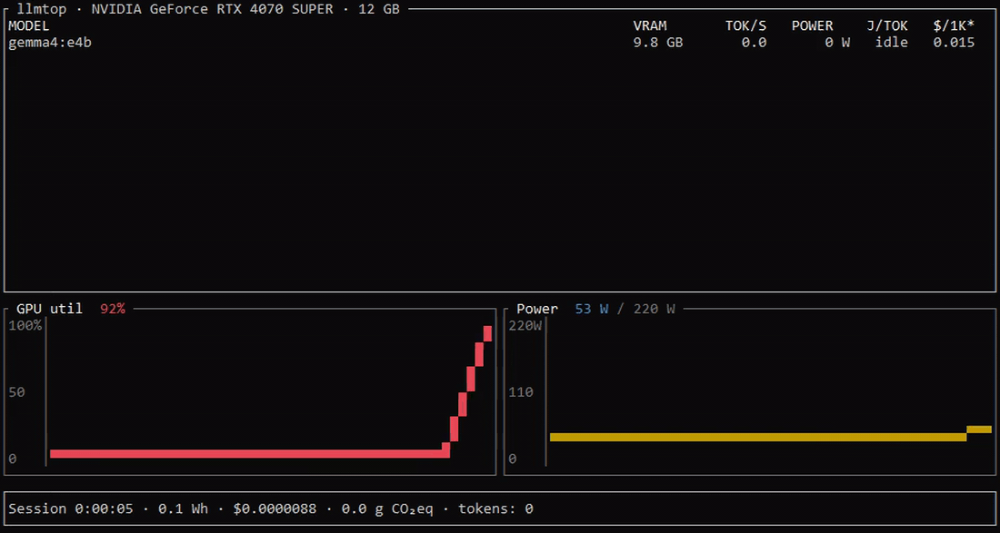

# llmtop

> A GPU monitor that knows which LLM is running and what each token costs in energy and dollar-equivalent.

`llmtop` is a terminal monitor for local LLM servers (Ollama today, llama.cpp next). It links GPU wattage to the model burning it, so you can answer:

- Which loaded model is using my VRAM right now?
- How many joules per token does this 32B coder cost?
- What would this generation have cost on the Claude Sonnet API?
- How much energy and CO₂ did this work session burn?



The `$/1K` column is per-1K output tokens at the cost of running on a hosted API. Default: Claude Sonnet. Switch with `--compare gpt-4o | gemini-2.5`.

## vs nvtop / nvitop / asitop

| Feature                   | nvtop   | nvitop | asitop     | **llmtop**            |
| ------------------------- | :-----: | :----: | :--------: | :-------------------: |
| GPU util / VRAM / power   | ✅      | ✅     | ✅         | ✅                    |
| Knows loaded LLM models   | ❌      | ❌     | ❌         | ✅                    |
| Per-model VRAM share      | ❌      | ❌     | ❌         | ✅                    |
| Joules per token          | ❌      | ❌     | ❌         | ✅                    |
| API-equivalent $ cost     | ❌      | ❌     | ❌         | ✅                    |
| Session kWh + CO₂         | ❌      | ❌     | ❌         | ✅                    |
| Cross-platform            | partial | ⚠️    | macOS only | Linux + Win + macOS\* |

\* macOS Apple Silicon support lands in v0.2.

## Install

```bash
cargo install llmtop
```

Pre-built binaries arrive with v0.1 release.

## Usage

```bash
llmtop                                  # poll http://127.0.0.1:11434
llmtop --ollama-url http://gpu:11434    # remote ollama
llmtop --compare gpt-4o                 # change cost-equivalent provider
llmtop --grid-co2 230                   # local grid intensity (gCO₂/kWh)
llmtop --proxy 11435                    # tee Ollama through us for live tok/s
```

Hotkeys: `q` quit, `p` pause, `c` clear session totals.

### Live tokens/sec

Ollama does not expose live throughput on `/api/ps`. To get the `TOK/S` and
`J/TOK` columns populated, run llmtop in proxy mode and point your client at
the proxy port:

```bash
llmtop --proxy 11435 &
OLLAMA_HOST=http://127.0.0.1:11435 ollama run qwen2.5-coder:7b "explain quicksort"
```

llmtop forwards every request to the upstream Ollama unchanged and reads
`eval_count` / `eval_duration` from the responses. Without `--proxy`, models
still appear in the table with VRAM, but `TOK/S` stays at `idle`.

## What's measured

| Metric                         | Source                                              |
| ------------------------------ | --------------------------------------------------- |
| GPU util / VRAM / power / temp | NVML (Linux, Windows). IOReport (macOS) in v0.2.    |
| Multi-GPU                      | Aggregated (sum power/VRAM, avg util) in v0.1.      |
| Loaded models, per-model VRAM  | Ollama `/api/ps`                                    |
| Tokens/sec live                | Reverse proxy (`--proxy <port>`) parses `eval_count` / `eval_duration` from `/api/generate` and `/api/chat` |
| J/token                        | `power_w / tokens_per_sec`                          |
| Session kWh                    | Trapezoidal integration of GPU power over time      |
| API-equivalent $               | Provider price tables in `src/pricing/mod.rs`       |
| CO₂eq                          | session kWh × `--grid-co2` (gCO₂/kWh)               |

## Roadmap

- [ ] v0.2: Apple Silicon (M1–M5) via IOReport, llama.cpp Prometheus, per-GPU breakdown view (`--per-gpu`)
- [ ] v0.3: vLLM, LM Studio, MLX
- [ ] v0.4: Prometheus exporter, JSON metrics, write-to-file mode
- [ ] v0.5: AMD ROCm, Intel Arc

## Wrong API price? Open a PR

Edit `src/pricing/mod.rs`.

## License

MIT
